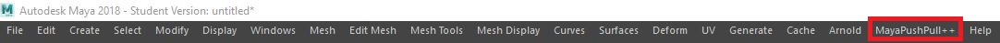
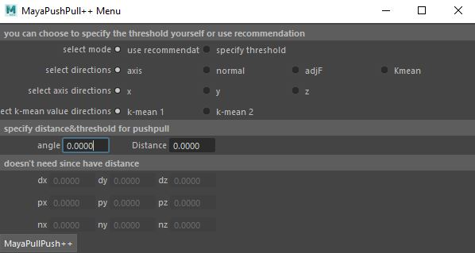
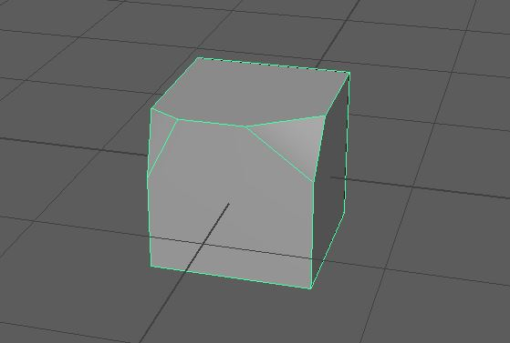
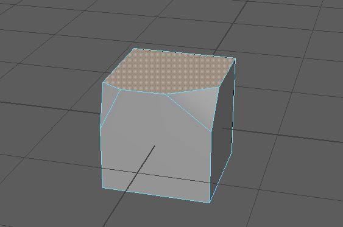
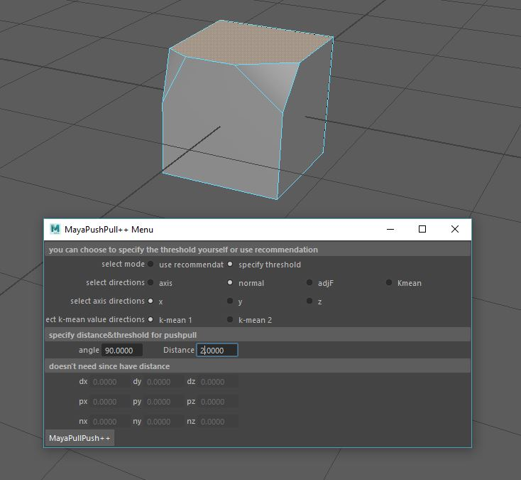
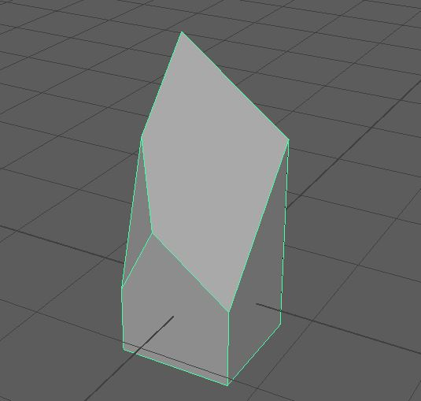

# MayaPushPullPlus
This project is a Maya plug-in developed in Visual Studio Community 2017. The plug-in is based on the 2014 Siggraph paper PushPull++, written by Markus Lipp, Peter Wonka and Pascal Muller. You can find the plug-in in pushpull\x64\Release\maya_pushpull++.mll. The plug in is tested in Maya 2018 64bit version.

## Results

### This is one example input.

### These are diffent outputs produced by this plug-in.

* Output 1

* Output 2

* Output 3

* Output 4

## Tutorial

### After loading the plugin into Maya, you will find this menu option in the menu bar.

### Click on the menu option and a window will pop up. This is where you set all the parameters.

### In this tutorial, our input is a polygonal mesh like the one in the picture below.

### We select the top face of the mesh.

### Then we tune the parameters and execute the command.

###### We select the user specified threshold mode, set the direction as normal direction of the selected face, set the threshold of the angle as 90 degrees and distance as 2 units. After set the parameters, we press the button labeled as “MayaPullPush++” to execute the command.

### The result of this operation is shown below.

